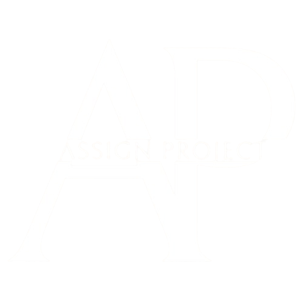
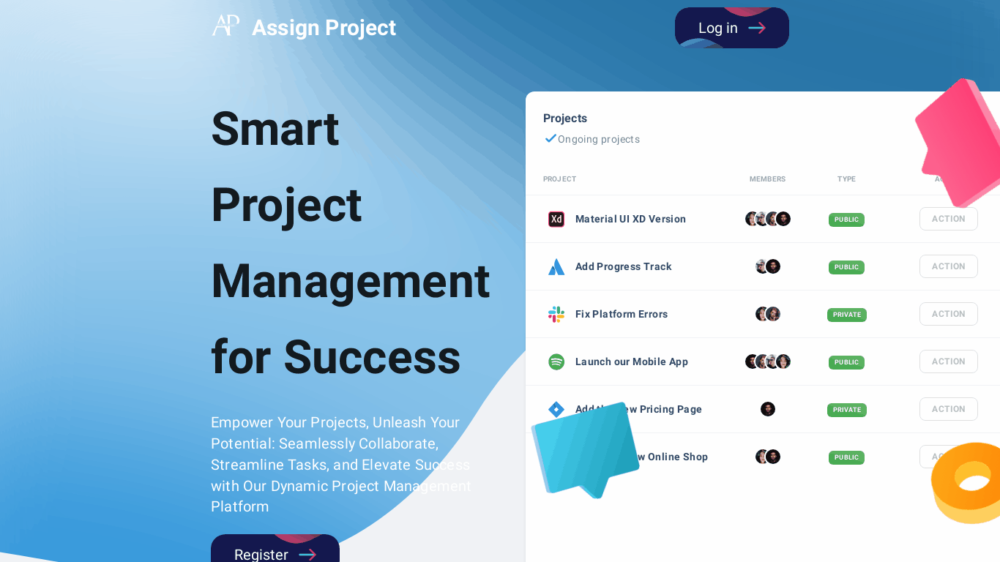

<div align="center">
  
  
  
  
  [](https://github.com/abhishekprajapati29/assign-project/commits/main)
  [](https://assign-project.onrender.com/)
  [](https://www.linkedin.com/in/abhishekprajapati29/)
  [](http://badges.mit-license.org)

  <br />
  <br />
  
  

  <h2 align="center">Assign Project - Project Management Application</h2>

Welcome to our innovative Project Management Application! This powerful tool is designed to revolutionize the way you manage projects, tasks, and team collaboration. Seamlessly combining efficiency and user-friendly design, our application brings together essential project management features to enhance your workflow.

<a href="https://assign-project.onrender.com/"><strong>➥ Project Live</strong></a>

</div>

<br />

## 🔥 Website Preview


## 📋 Key Features
⚡️ **Dashboard**: Get a comprehensive overview of your projects, tasks, and deadlines in one centralized dashboard.\
⚡️ **Task Tracking**: Effortlessly monitor the progress of individual tasks and ensure every team member stays on track.\
⚡️ **Bug Reporting**: Quickly identify and report bugs, facilitating swift resolution and maintaining project integrity.\
⚡️ **File Storage**: Organize and access project-related files with ease, ensuring documents are readily available when needed.\
⚡️ **Activity Tracking**: Visualize project progress through a dynamic activity tracking system, turning progress into a visual masterpiece.

## 💡 MERN Tech Stack
- [MongoDB](https://www.mongodb.com/): A NoSQL database that provides high performance, high availability, and easy scalability.
- [Express.js](https://expressjs.com/): A fast, unopinionated, minimalist web framework for Node.js, providing a robust set of features.
- [React](https://reactjs.org/): A JavaScript library for building user interfaces, enabling the creation of dynamic and interactive web applications.
- [Node.js](https://nodejs.org/): A JavaScript runtime built on Chrome's V8 JavaScript engine, facilitating server-side development.
- And more...

## 🌐 NPM Package
| Name                                       | Version   | Description                                               |
| ------------------------------------------ | --------- | --------------------------------------------------------- |
| React                                      | ^18.2.0   | A JavaScript library for building user interfaces.         |
| Material-UI                                | ^5.12.3   | A popular React UI framework implementing Material Design. |
| React Redux                                | ^8.1.3    | A predictable state container for JavaScript apps.        |
| React Router DOM                           | 6.11.0    | Declarative routing for React.js.                          |
| Axios                                      | ^1.6.2    | A promise-based HTTP client for the browser and Node.js.  |
| Redux Thunk                                | ^2.4.2    | Middleware for Redux allowing asynchronous logic.         |
| Styled Components                          | ^6.1.1    | A CSS-in-JS library for styling React components.          |
| Chart.js                                   | 4.3.0     | A flexible JavaScript charting library.                    |
| React Table                                | 7.8.0     | A lightweight, fast, and extendable data grid for React.   |
| Yup                                        | 1.1.1     | A JavaScript schema builder for validation.                |
| React Quill                                | ^2.0.0    | A React wrapper for the Quill rich text editor.           |
| Dayjs                                      | ^1.11.10  | A minimalist JavaScript library for dates.                 |
| Yet Another React Lightbox                 | ^3.15.6   | A responsive image lightbox component for React.           |
| React Reveal                               | ^1.2.2    | An animation library for React.                            |
| React GitHub Button                        | 1.4.0     | A React component for embedding GitHub buttons.            |
| Chroma.js                                  | 2.4.2     | A JavaScript library for handling color.                   |
| DOMPurify                                  | ^3.0.6    | A library for HTML sanitization to prevent XSS attacks.    |
| @Mui/X-Date-Pickers                       | ^6.18.4   | Material-UI components for date pickers.                   |
| Web Vitals                                 | ^2.1.0    | A library for measuring web performance metrics.           |
| Testing Libraries (Jest and Testing Library)| Various   | Libraries for testing JavaScript and React applications.   |
| Emotion                                    | 11.10.8   | A CSS-in-JS library for styling React components.          |
| Eslint                                    | Various   | A linting tool for identifying patterns in JavaScript code. |
| Browserslist                               | -         | A config to share target browsers between different tools. |
| React Scripts                              | 5.0.1     | Scripts and configurations used by Create React App.       |
| Prop Types                                 | 15.8.1    | Runtime type checking for React props.                     |
| Stylis                                     | 4.1.4     | A CSS preprocessor.                                       |

## 🍼 How It Works

1. **Dashboard Insights:**
   - Instantly view project summaries, pending tasks, and upcoming deadlines for effective project oversight.

2. **Task Management:**
   - Create, assign, and monitor tasks, promoting transparency and accountability within your team.

3. **Bug Reporting Made Simple:**
   - Streamline the bug reporting process, ensuring quick identification and resolution.

4. **Efficient File Storage:**
   - Easily upload and organize project files, ensuring everyone has access to the latest documents.

5. **Visualize Progress:**
   - Track project activities visually, turning progress into an engaging and insightful experience.

## 🧊 Why Choose Our Project Management Application?

- **User-Friendly Interface:**
  - Navigate through the application effortlessly, making project management a breeze for everyone.

- **Efficiency Boost:**
  - Increase productivity and reduce development time with our carefully crafted features.

- **Reliability:**
  - Rely on our robust backend and frontend technologies, including NodeJS, Apollo GraphQL, and ReactJS.

- **Enhanced User Experience:**
  - Our focus on bug reduction and system optimization leads to a 40% increase in user retention and satisfaction.

## 🔬 Get Started

Ready to take your project management to the next level? Sign up today and experience the difference our Project Management Application can make in streamlining your workflow.

[Sign Up Now](https://assign-project.onrender.com/register)


## 🛠️ Prerequisites
Before you begin, ensure you have met the following requirements:

- [Git](https://git-scm.com/downloads "Download Git") must be installed on your operating system.
- npm (comes with Node.js) or yarn (Recommended: [Yarn](https://yarnpkg.com/))

## ⭐ Environment Variables
To run the project locally, you need to set up the following environment variables. Create a `.env` file in the root of your project and add the following:

```env
REACT_APP_BACKEND_URL=http://localhost:3001/
```


## 📦 Installation
1. **Clone the repository:**

   ```bash
   git clone https://github.com/abhishekprajapati29/assign-project.git
   ```
   
2. **Navigate to the project directory:**

   ```bash
   cd assign-project/client
   ```
   
3. **Install dependencies:**

   ```bash
   npm install   # or yarn install
   ```
   
4. **Start the development server:**

   ```bash
   npm start     # or yarn start
   ```
    
7. **Deployment:**
   To deploy your website, first you need to create github repository with name `<your-github-username>.github.io` and push the generated code to the `main` branch.


## 🪒 Layouts

- **Dashboard Layouts**
  - `MainDashboard`: Main dashboard layout for authenticated users.
  - `Dashboard`: Dashboard layout for individual projects.

- **Authentication Layouts**
  - `SignIn`: Layout for user sign-in.
  - `SignUp`: Layout for user sign-up.

- **Project Layouts**
  - `HomePage`: Layout for the home page.
  - `ProjectView`: Layout for viewing projects.
  - `Task`: Layout for managing tasks.
  - `Bug`: Layout for managing bugs.
  - `TaskView`: Layout for viewing task details.
  - `MemberTable`: Layout for managing project members.
  - `SettingOverview`: Layout for project settings.
  - `ProjectCreateForm`: Layout for creating a new project.
  - `TaskForm`: Layout for managing tasks within a project.
  - `TaskCreateForm`: Layout for creating a new task within a project.
  - `Files`: Layout for managing project files.
  - `Invites`: Layout for managing project invites.

- **Profile Layout**
  - `Profile`: Layout for user profile.

- **Miscellaneous Layouts**
  - `HomePage`: Layout for the home page.

## 🚍 Icons

- `Icon`: Icon component for rendering Material-UI icons.

## 📜 Routes

The `routes` array contains configurations for different routes in the application. Each route object has the following properties:

- `type`: Describes the type of route (collapse, title, divider).
- `name`: Name of the route or title.
- `key`: Unique key for the route.
- `icon`: Material-UI icon component.
- `isAuth`: Boolean indicating whether authentication is required.
- `isProject`: Boolean indicating whether the route is related to a project.
- `route`: The route location for React Router.
- `href`: External link location.
- `title`: Title text for the Sidenav.
- `component`: React component associated with the route.

## ✨ Components

- Various components used throughout the application.

## 🧪 How to Add a New Route

To add a new route, follow the existing routes in the `routes` array. Use the provided keys like `type`, `name`, `key`, `icon`, etc. Make sure to specify the `component` property with the associated React component.

Feel free to adjust the project structure based on specific requirements.


## 🚶 Contributing

Feel free to contribute to this project! Whether it's reporting bugs, suggesting enhancements, or adding new features, your contributions are welcome. Please follow the [contribution guidelines](CONTRIBUTING.md).

### 📝 License

This project is licensed under the [MIT License](LICENSE).

---

Thank you for visiting my portfolio! If you have any questions or suggestions, feel free to reach out.
